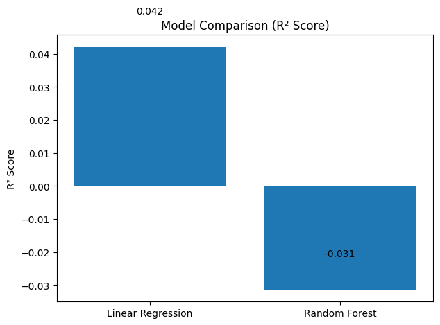
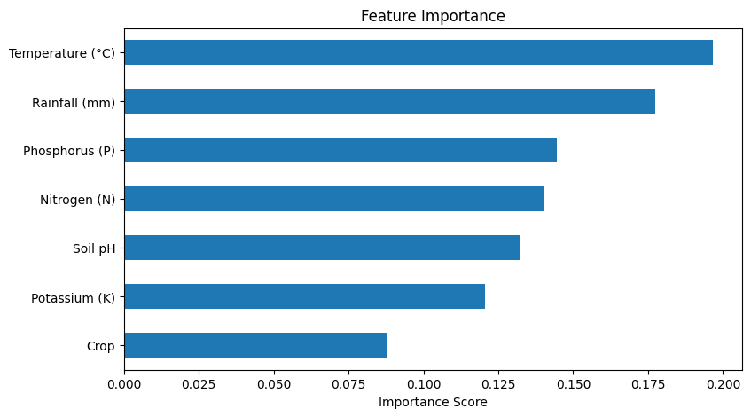

# 🌾 Crop Yield Prediction using Machine Learning

Machine Learning-based crop yield prediction using environmental and agricultural parameters. This project compares **Linear Regression** and **Random Forest Regression** models to estimate crop yield and identify the most influential agricultural factors affecting productivity.

---

## Project Overview

Accurate crop yield prediction plays an important role in precision agriculture by helping farmers and policymakers make informed decisions regarding crop planning and resource management.

This project develops a machine learning pipeline that:

- Performs data preprocessing and feature engineering
- Visualizes relationships between agricultural parameters
- Trains multiple regression models
- Evaluates model performance using standard regression metrics
- Identifies important features influencing crop yield
- Predicts crop yield for new agricultural conditions

---

## Results

| Model | Evaluation Metric |
|--------|-------------------|
| Linear Regression | MAE, RMSE, R² Score |
| Random Forest Regression | MAE, RMSE, R² Score |

Random Forest Regression achieved better predictive performance compared to Linear Regression and was selected as the final model for crop yield prediction.

---

## Figures

### System Architecture

<p align="center">

</p>

---

### Workflow

<p align="center">

</p>

---

### Model Comparison

<p align="center">

</p>

---

### Feature Importance

<p align="center">

</p>

---

### Actual vs Predicted Yield

<p align="center">

</p>

---

## Repository Structure

```text
crop-yield-prediction/
│
├── README.md
├── requirements.txt
├── .gitignore
│
├── data/
│   └── README.md
│
├── images/
│   ├── architecture.png
│   ├── workflow.png
│   ├── model_comparison.png
│   ├── feature_importance.png
│   └── prediction_example.png
│
├── notebooks/
│   └── Crop_Yield_Prediction.ipynb
│
├── src/
│   ├── data_preprocessing.py
│   ├── visualization.py
│   ├── train_models.py
│   ├── evaluation.py
│   └── predict.py
│
└── run.py
```

---

## Technologies Used

- Python
- Pandas
- NumPy
- Matplotlib
- Seaborn
- Scikit-learn
- Jupyter Notebook

---

## Machine Learning Pipeline

1. Load agricultural dataset
2. Data preprocessing
3. Label encoding
4. Feature scaling
5. Exploratory data analysis
6. Train-test split
7. Train Linear Regression model
8. Train Random Forest Regression model
9. Model evaluation
10. Feature importance analysis
11. Crop yield prediction

---

## Evaluation Metrics

- Mean Absolute Error (MAE)
- Root Mean Square Error (RMSE)
- R² Score

---

## Installation

```bash
git clone https://github.com/<your-username>/crop-yield-prediction.git

cd crop-yield-prediction

pip install -r requirements.txt
```

---

## Usage

Place the dataset inside the **data/** folder and update the dataset path inside `run.py` if required.

Run:

```bash
python run.py
```

---

## Future Improvements

- Hyperparameter tuning
- XGBoost and LightGBM models
- Web-based prediction interface using Streamlit
- Support for larger agricultural datasets
- Model deployment using Flask or FastAPI

---

## Author

**Vibha I S**

GitHub: https://github.com/<your-username>
